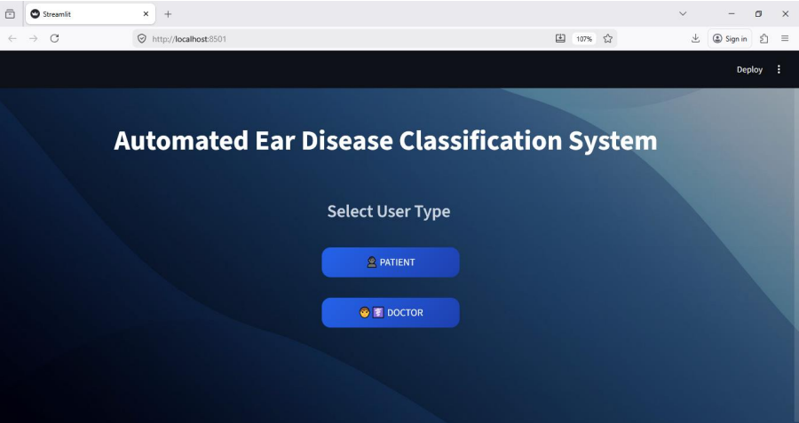
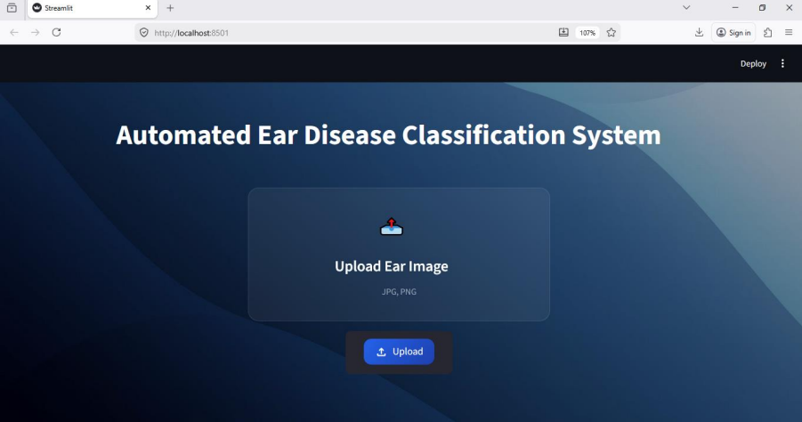
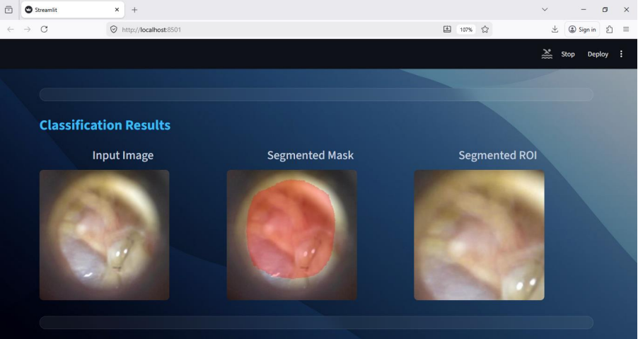
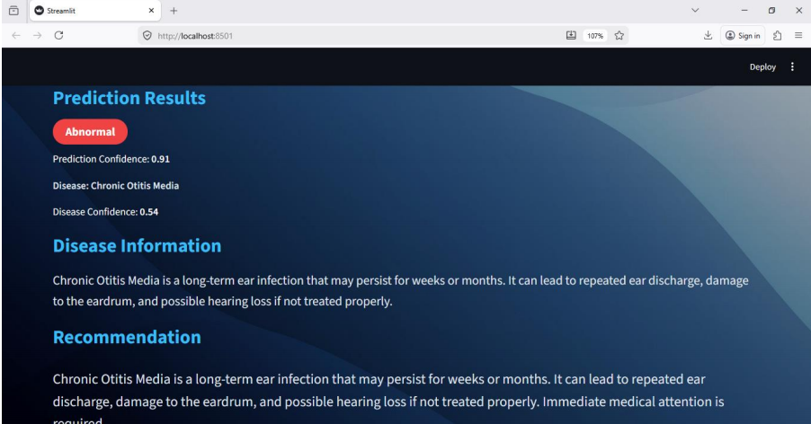
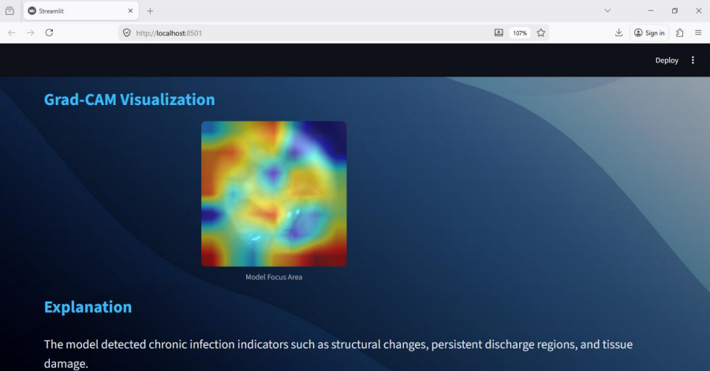
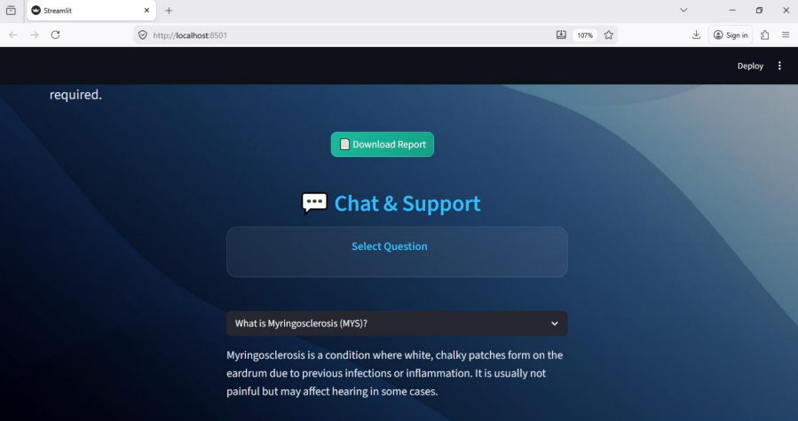

# Multi-Class Ear Disease Classification Using Deep Learning

## Overview

Ear diseases are among the most common medical conditions affecting people of all age groups and may lead to pain, hearing loss, and discomfort if not detected early. This project presents an **AI-powered diagnostic support system** that automatically analyzes otoscopic ear images and predicts whether the ear is normal or abnormal. If an abnormal condition is detected, the system further classifies the disease into a specific category.

The project combines **deep learning, image segmentation, and explainable AI** within an interactive **Streamlit web application** designed for both patients and doctors.

---

## Key Features

* Two-stage classification pipeline:

  * **Binary classification**: Normal vs Abnormal
  * **Multi-class classification**: AOM, COM, MYS, CI
* **Swin Transformer** used as the primary classification model
* **EfficientNet-B0** used for Grad-CAM visualization
* **U-Net segmentation** to extract the ear region of interest (ROI)
* **Grad-CAM** for explainable AI and model interpretability
* Separate interfaces for **Patient** and **Doctor**
* Confidence score display
* PDF report generation
* Local deployment using **Streamlit**

---

## Disease Classes

| Code   | Disease                            |
| ------ | ---------------------------------- |
| AOM    | Acute Otitis Media                 |
| COM    | Chronic Otitis Media               |
| MYS    | Myringosclerosis                   |
| CI     | Cochlear Implant-related condition |
| Normal | Healthy ear                        |

---

## Dataset

The system was trained using approximately **2,900 otoscopic ear images** collected from the **Roboflow Universe** repository. The dataset contains both normal and abnormal ear conditions and was used for binary and multi-class classification experiments.

---

## Deep Learning Models

Several architectures were implemented and compared during experimentation:

* ResNet18
* EfficientNet-B0
* Vision Transformer (ViT)
* Swin Transformer
* U-Net (Segmentation)

The **Swin Transformer achieved the best classification performance** and was selected for deployment.

---

## System Workflow

```text
Input Ear Image
        ↓
U-Net Segmentation
        ↓
ROI Extraction
        ↓
Binary Classification
(Normal / Abnormal)
        ↓
If Abnormal
        ↓
Multi-Class Classification
(AOM / COM / MYS / CI)
        ↓
Grad-CAM Visualization
        ↓
Prediction + Confidence + PDF Report
```

---

## Technologies Used

* Python
* PyTorch
* timm
* OpenCV
* Streamlit
* NumPy
* Pillow
* ReportLab
* Grad-CAM
* Google Colab

---

## Project Structure

```text
multi-class-ear-disease-classification-using-deep-learning/
│
├── README.md
├── requirements.txt
├── app.py
│
├── notebooks/
│   ├── EfficientNetB0.ipynb
│   ├── Integration.ipynb
│   ├── Main_GRADCAM.ipynb
│   ├── Resnet18.ipynb
│   ├── Swin_Transformer.ipynb
│   ├── U_NET_Segmentation.ipynb
│   └── Vision_Transformer.ipynb
│
└── screenshots/
    ├── home_page.png
    ├── patient_page.png
    ├── segmentation_result.png
    ├── classification_result.png
    ├── gradcam.png
    └── pdf_report.png
```

---

## Development Environment

* **Model Training:** Google Colab
* **Application Development:** Python + Streamlit
* **Local Execution:** Command Prompt / Terminal
* **Version Control:** GitHub

---

## Installation

Clone the repository:

```bash
git clone https://github.com/RenukaAshok/multi-class-ear-disease-classification-using-deep-learning.git
```

Navigate to the project folder:

```bash
cd multi-class-ear-disease-classification-using-deep-learning
```

Install dependencies:

```bash
pip install -r requirements.txt
```

---

## Run the Application

Start the Streamlit application locally:

```bash
streamlit run app.py
```

Open the browser at:

```text
http://localhost:8501
```

---

## Application Screenshots

### Home Page



### Upload Interface



### Segmentation Result



### Classification Result



### Grad-CAM Visualization



### PDF Report and Chat Support



---

## Explainable AI

Grad-CAM highlights the image regions that contribute most to the model prediction. This helps doctors understand **why** the model predicted a particular disease and improves trust in the AI system.

---

## Important Note

**Trained model weight files (`.pth`) are not included in this repository due to file size limitations.** The notebooks contain the complete training pipeline, architecture definitions, preprocessing steps, and evaluation procedures required to reproduce the models.

---

## Future Enhancements

* Cloud deployment for remote access
* Mobile-friendly interface
* Integration with hospital information systems
* Larger multi-center dataset
* Real-time video otoscopy support
* Advanced explainability techniques

---

## Author

**Renuka A**
Integrated M.Tech (Software Engineering)
Vellore Institute of Technology, Vellore

GitHub: https://github.com/RenukaAshok

---

## Acknowledgement

This project was developed as a capstone project to explore the application of deep learning and explainable AI in medical image analysis and to support early detection of ear diseases using otoscopic images.
